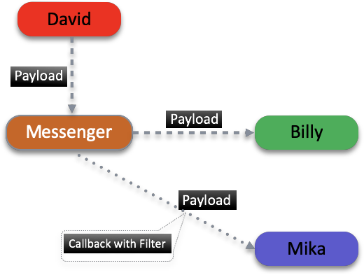
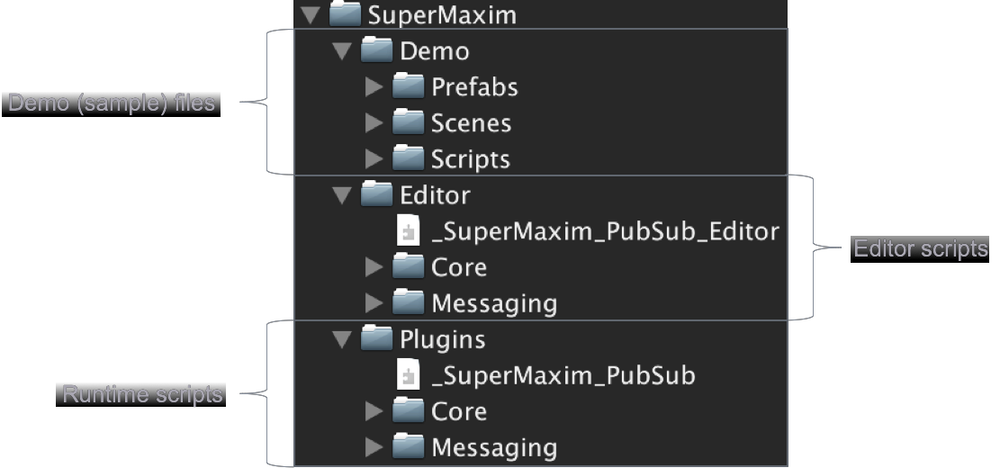
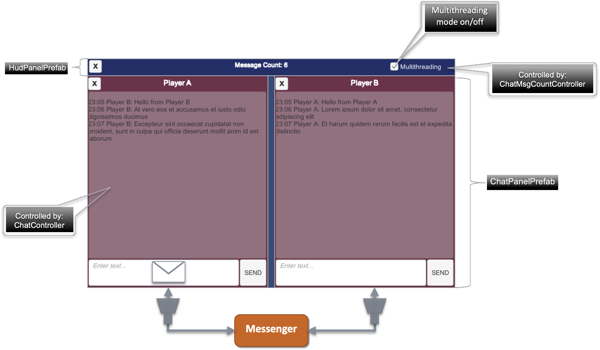

# Pub/Sub Messaging in Unity

**Pub-Sub Messenger** is a Lightweight, Open Source Library for Unity.
This library will provide a pub-sub mechanism that is a part of SOLID principles in programming.

## Contents
* [The Problem](#the-problem)
* [The Solution](#the-solution)
* [Message Routing](#message-routing)
* [Messenger API](#messenger-api)
* [Use Cases](#use-cases)
* [Correct Usage](#correct-usage)
* [MainThreadDispatcher API](#mainthreaddispatcher-api)
* [Package Structure](#package-structure)
* [Unit Tests](#unit-tests)
* [DEMO Project](#demo-project)

### Youtube Video with Instructions:
[](http://www.youtube.com/watch?v=vI0XYKGAZLg)

***

## The Problem

* **Wiring the Parts with Events** – Tightly Coupled and may cause Memory Leak problems. The Publisher and the Subscriber have to know of each other, and a Subscriber can't be collected by the GC if it's connected with the Publisher with strong event reference.
* **Using Unity Event Routing** – Although Unity Event Routing is a very good feature, it is a Unity Specific Solution and we need a generic one. Also, we cannot use it everywhere even if the project is in Unity.
* **Dependency** - In commonly used C# events or delegates, classes are “familiar” with each other and this prevents good modularity. This is NOT following SOLID Principles and Objects are not Encapsulated.

### Example of common usages of events in C#:

```csharp
public class Human
{
    // event that passes instance of Stick when it is invoked
    public event Action<Stick> FetchStick;
    
    // static event that passes instance of Ball when it is invoked
    public static event Action<Ball> FetchBall;
}

public class Dog : Animal
{
    // event handler - method that is invoked by event and receives Stick instance
    public void OnFetchStick(Stick stick) { /*TODO*/ }
}

public class Cat : Animal
{
    // event handler - method that is invoked by event and receives Ball instance
    public void OnFetchBall(Ball ball) { /*TODO*/ }
}

public class Playground
{
    public Human David { get; set; }
    private Dog Rex { get; set; }
    private Cat Max { get; set; }

    public void RegisterEvents()
    {
        David.FetchStick += Rex.OnFetchStick;
        Human.FetchBall += Max.OnFetchBall;
    }
}
```

> Rex.OnFetchStick is attached to David.FetchStick and David instance has reference to Rex instance. Rex instance will not be removed from the memory until it's handler OnFetchStick will be detached from FetchStick event or until David will be removed from the memory.


> Max.OnFetchBall is attached to Human.FetchBall and Max instance is referenced by static pointer Human.FetchBall. Max instance will not be removed from the memory until it's handler OnFetchBall will be detached from static event FetchBall. Static references are worse case of memory leaks.

***

## The Solution

* **Pub\Sub Messenger** - Container for Events that allows Decoupling of Publishers and Subscribers so they can evolve independently. This Decoupling is useful in Modularised Applications because new modules can be added that respond to events defined by the Shell or, more likely, other modules. All events have a Weak Reference and invocation can be done Async or Sync way.
* Instead of passing objects or modules, pass small **Payloads** (Data/Messages) that are relevant for the specific cases/events.
* Classes/Modules will not be “familiar” with each other, this will allow better **encapsulation and less dependencies**.
* In case of subscriber’s destruction, it will be removed automatically from Messenger’s list, since it was referenced via **Weak Reference**.
* Pub/Sub can be a great pattern in combination with _Dependency Injection_ (DP) and with _Inversion of Control_ (IoC), both part of _SOLID_ Principles.

### Usage of Messenger as Pub/Sub mechanism:

```csharp
public class FetchStickPayload
{
     // stick type for filtering
     public StickTypes StickType { get; set; }
     
     // the position of stick in the space
     public Vector3 Position { get; set; }
}

// publisher
public class Human
{
     public void PublishFetchStickPayload()
     {
         // publish new payload with specific data
         Messenger.Default.Publish(
              new FetchStickPayload 
                       { 
                              StickType = StickTypes.PlasticStick, 
                              Position = new Vector3(1, 1, 0) 
                       });
     }
}

// subscriber
public class Dog : Animal
{
     // callback - method that is invoked by Messenger and receives payload instance
     public void OnFetchStick(FetchStickPayload payload) { /* TODO handle stick fetching */ }
}

public class Playground
{
     public Human David { get; set; }
     public Dog Billy { get; set; }
     public Dog Mika { get; set; }

     public void Subscribe()
     { 
         // subscribe callback Billy.OnFetchStick to FetchStickPayload
         Messenger.Default.Subscribe<FetchStickPayload>(Billy.OnFetchStick);
        
         // subscribe callback Mika.OnFetchStick to FetchStickPayload with filter/predicate
         Messenger.Default.Subscribe<FetchStickPayload>(Mika.OnFetchStick, CanFetchStick);
     }

     private bool CanFetchStick(FetchStickPayload payload) { /* TODO filter unwanted stick types */ }
}
```


***

## Message Routing


***

## Messenger API

### Messenger implements this interface:

```csharp
// Messenger Interface
public interface IMessenger
{
    // Subscribe callback to receive a payload
    // Predicate to filter the payload (optional)
    IMessenger Subscribe<T>(Action<T> callback, Predicate<T> predicate = null);

    // Unsubscribe the callback from receiving the payload 
    IMessenger Unsubscribe<T>(Action<T> callback);

    // Publish the payload to its subscribers
    IMessenger Publish<T>(T payload);
}
```

Access to default Messenger instance via: 
```csharp
SuperMaxim.Messaging.Messenger.Default.[function]
```

### Publish

```csharp
// Generic Parameter <T> - here is a <Payload> that will be published to subscribers of this type
Messenger.Default.Publish<Payload>(new Payload{ /* payload params */ });

// In most cases there is no need in specifying Generic Parameter <T>
Messenger.Default.Publish(new Payload{ /* payload params */ });

// Generic Parameter <T> - here is a <IPayload> that will be published to subscribers of this type
Messenger.Default.Publish<IPayload>(new Payload{ /* payload params */ });

class Payload : IPayload
{

}
```

### Subscribe

```csharp
// Payload – the type of Callback parameter
// Callback – delegate (Action<T>) that will receive the payload
Messenger.Default.Subscribe<Payload>(Callback);

private static void Callback(Payload payload)
{
  // Callback logic
}
```

### Subscribe with Predicate

```csharp
// Predicate – delegate (Predicate<T>) that will receive payload to filter
Messenger.Default.Subscribe<Payload>(Callback, Predicate);

private static bool Predicate(Payload payload)
{
  // Predicate filter logic
  // if function will return ‘false’ value, the Callback will not be invoked
  return accepted;
}
```

### Unsubscribe - Variant #1

```csharp
// Payload – the type of Callback parameter that was subscribed
// Callback – delegate (Action<Payload>) that was subscribed
Messenger.Default.Unsubscribe<Payload>(Callback);

private static void Callback(Payload payload)
{
  // Callback logic
}
```

### Unsubscribe - Variant #2

```csharp
// IPayload – the type of Callback parameter that was subscribed
// Callback – delegate (Action<Payload>) that was subscribed
Messenger.Default.Unsubscribe<IPayload>(Callback);

// Payload class implements IPayload interface
private static void Callback(Payload payload)
{
  // Callback logic
}
```

***

## Use Cases

* **Pass Payload** between disconnected parts of code.
* **Thread Safe** invocation of callbacks between disconnected parts of code.
* **Asynchronous** invocation of callbacks between disconnected parts of code.
* **Filtered** invocation of callbacks between disconnected parts of code.
* **Obfuscated** invocation of callbacks between disconnected parts of code.

***

## Correct Usage

* **DON’T** use Messenger if you have a direct access to shared code parts to invoke events/methods in the same module/class.
* **ALWAYS** ensure that you unsubscribe when you’re done with the consuming of payloads.
* **DON’T** publish payloads in endless or in a long running loops.
* **PREFER** using Filtered subscriptions.

***

## MainThreadDispatcher API

Main Thread dispatcher is responsible for the synchronisation of callbacks between Main and other threads.

### MainThreadDispatcher implements this interface:

```csharp
public interface IThreadDispatcher
{
    // managed Thread ID
    int ThreadId { get; }

    // dispatch - adds callback delegate into dispatcher’s queue
    // action - delegate reference to method that should be invoked on main thread
    // payload - the data that should be passed to the method/callback
    void Dispatch(Delegate action, object[] payload);
}
```

### Dispatch Method - example

```csharp
MainThreadDispatcher.Default.Dispatch(Callback, new object[] { payload, state });
```

***

## Package Structure

### Package Folders

> Folders with name “Core” contain base classes and scripts that are shared across different modules.
> Folders with name “Messaging” contain classes and scripts that are specific for the Messenger.
### Plugins / Core

> Extensions – extensions classes
> Objects – core base classes
> Threading – multithreading related classes/scripts
> WeakRef – weak reference handling classes
### Plugins / Messaging

> Components – useful unity components
> Monitor – debugging and monitoring tools

***

## Unit Tests

### Coverage:

**Messenger Tests**
* Functional
* Load
* Multithreading

**Weak Reference Tests**
* Functional

**Tests Folder**


**Playmode Tests**


***

## DEMO Project

### Goals:
* Show how to use Messenger
* Use real world example – Chat between players
* Include examples of message filtering and multithreading
* Show “Best Practices” approach in implementation

### [[WebGL Demo]](PubSub/index.html)

### Demo Structure
**Folders / Files**


**Sample Scene**


***

[Project License](https://github.com/supermax/pubsub/wiki/LICENSE)  |  [Discord](https://discord.gg/aQpx8a)  |  [Asset Store](http://u3d.as/1HKn)
